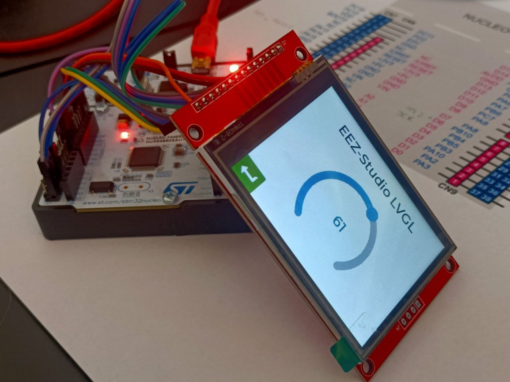
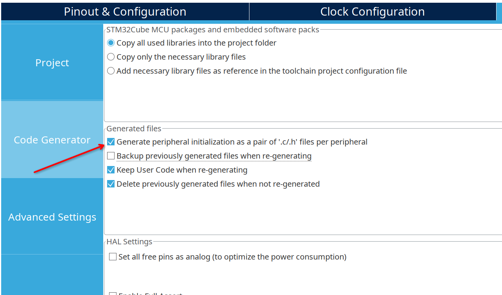
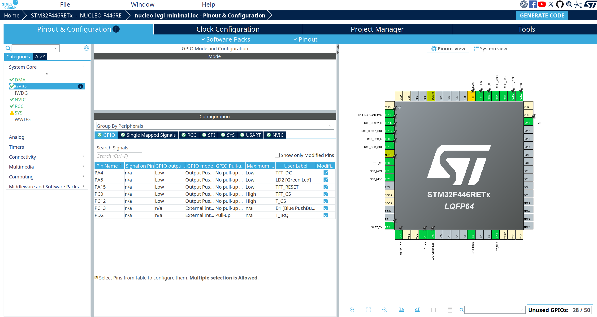
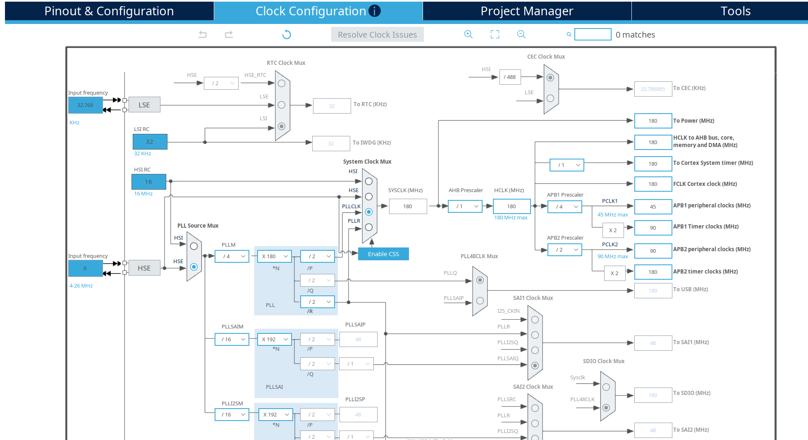
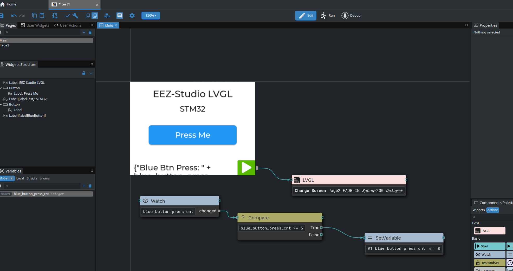
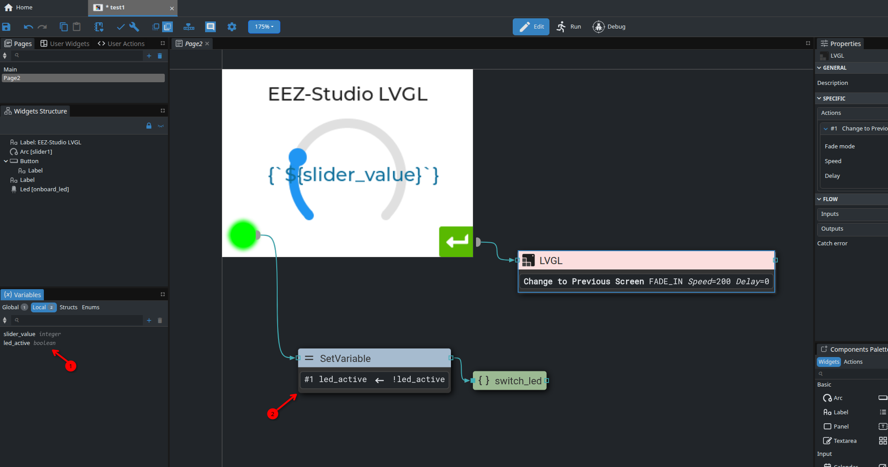
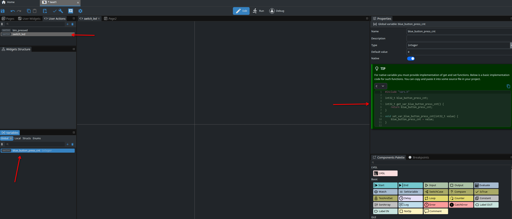

STM32 Nucleo-F446RE LVGL9 Minimal Project
==========================================

Testing LVGL9 with STM32 Nucleo-F446RE demoboard.

Use LVGL v9.2.3

https://lvgl.io/

Based on TFT and Touch Drivers by Kevin Fox (kpf5297)

https://github.com/kpf5297/ILI9341-TFT-LVGL

Use EEZ-Studio v0.26.2 and EEZ-Flow to create UI and some UI automations.

https://www.envox.eu/studio/studio-introduction/

I use a TFT Display 2.8" 320x240 with resistive touch, both using SPI. The TFT uses the  ILI9341 SOC Driver and the touch uses the XPT2046 controller.

# Configure and compile the project

I initially followed the steps described in:
https://github.com/kpf5297/ILI9341-TFT-LVGL/blob/main/README.md

But this results in a huge repository, including the full drivers with examples and zip files and lvgl source code with demo and examples.

So I finally created this minimal repository including only the required files.

I use STM32CubeMX to define SPI ports and GPIO, and finally to generate the base code.

I use FreeRTOS as described in Kevin Fox examples; but created also a minimal alternative with main loop (just for debug purpose).

## Project structure

- placed lvgl source (without demo and examples) in `Middlewares/Third_Party/lvgl_v9.2_minimal` directory
- removed (commented out) examples and demo from `lvgl.mk`
- placed TFT and Touch driver from kpf5297/ILI9341-TFT-LVGL repository into `Drivers/ILI9341_XPT2046` (only driver sources)
- added eez-studio project file in project directory
- configured eez-studio to generate UI files into `/Core/Src/ui`

## Compilation notes
- added driver .c/.h files to Makefile directly, since at the moment I don't use CMake
- changed option in CubeMX code generator tab, to create .c/.h individual files, imported in tft and tp drivers 
- created my custom board file for TFT+TP to use SPI2/SPI3 and custom labels: `Drivers/ILI9341_XPT2046/Board/boards/board_stm32f446_it.h` and included it in `Drivers/ILI9341_XPT2046/Board/board_config.h`
- included `lvgl.mk` to `Makefile` and added `$(CSRCS)` to sources list to compile lvgl library
- created a stub in `freertos.c` for `osThreadDetach()`

## Notes on GPIO and SPI

- used SPI2 (TFT) and SPI3 (TP) because SPI1 is already used in default Nucleo configuration
- changed names of GPIO in CubeMX to clearify if used by tft or touch panel. So need to adjust the board definition file

## Wiring 

The Display is powered at 5V. It is wired directly to the morpho connector of the Nucelo using 2 SPI buses and some GPIO (used for CD, DC, RESET, Touch IRQ...).

SPI2 is used to communicate woth TFT Display.

SPI3 is used for touch panel.

| Pin  | Pin Name | Destination | Label             | Function    |
|------|----------|-------------|-------------------|-------------|
| 8    | PC0      | Display     | TFT_CS            | CS          |
| 50   | PA15     | Display     | TFT_RESET         | RESET       |
| 20   | PA4      | Display     | TFT_DC            | DC          |
| 9    | PC1      | Display     | SPI2_MOSI         | MOSI (TFT)  |
| 30   | PB10     | Display     | SPI2_SCK          | SCK (TFT)   |
|      | +3V3     | Display     | LED               | LED (TFT)   |
| 51   | PC10     | Touch       | SPI3_SCK          | T_CLK       |
| 53   | PC12     | Touch       | T_CS              | T_CS        |
| 26   | PB0      | Touch       | SPI3_MOSI         | T_DIN       |
| 52   | PC11     | Touch       | SPI3_MISO         | T_DO        |
| 54   | PD2      | Touch       | T_IRQ             | T_IRQ       |
| 21   | PA5      | Nucleo      | LD2               | Green Led   |
| 2    | PC13     | Nucleo      | GPIO_EXTI13       | Blue Button |

# EEZ-Studio and EEZ-Flow

I use EEZ-Studio to design UI and generate LVGL code.  The demo consists of 2 pages.

I also enabled EEZ-Flow to use some UI automation using visual programming. Usefull for page changes, set/display variables, ...

The vars and actions described here are just for educational purpose, to demonstrate how to make UI and code interact.

## Native Actions: Button callback

Created a Native User Actions `btn_pressed` and assignet to PRESSED event handler of the Button in Main Page.  It calls the native actions each time is pressed.

You have to implment action callback as suggested by EEZ-Studio. I created a dedicated `ui_logic.c` file. In the `action_btn_pressed()` callback I assign directly the text value of the label `label_test`.

## Native Action: Switch Led

Created a Native User Actions `switch_led`. Then created a SetVariable Flow Node connected to the PRESSED event of the Led in Page2. It switch an internal variable `led_active` used to set the led brightness. Finally the flow calls the `switch_led` native actions, and the callback associated.
The callback is defined in `ui_logic.c` and toggle the physical LED connected to pin PA5.

This demonstrate how to execute HW-related code when a UI action is performed.

## Native Variable: Blue Button Counter

Created a Native Variable `blue_button_press_cnt` as integer. As suggested by EEZ-Studio, you have to implement setter and getter in your native code.  I done this in `ui_logic.c` and exported the `blue_button_press_cnt` definition as external in `ui_logic.h`.

Finally I read the state of the on-board blue button (connected to `GPIO_EXTI13`) and when pressed I increment the value of blue_button_press_cnt, using the setter function. This is notified to UI. The new value is displayed in the `labelBlueButton` in Main Page.

The Flow Nodes `Watch`, `Compare` and `SetVariable` are used to read the value of `blue_button_press_cnt` and reset it when the value of 5 is reached.

This demonstrate how to set UI variables depending on HW states or values, display the values in UI and use EEZ-Flow to perform additional logic.

## Page Change

The page changes from Main Page to Page1 and returns are performed directly with eez-flow nodes connected to PRESSED event of the buttons in the bottom of the page.
